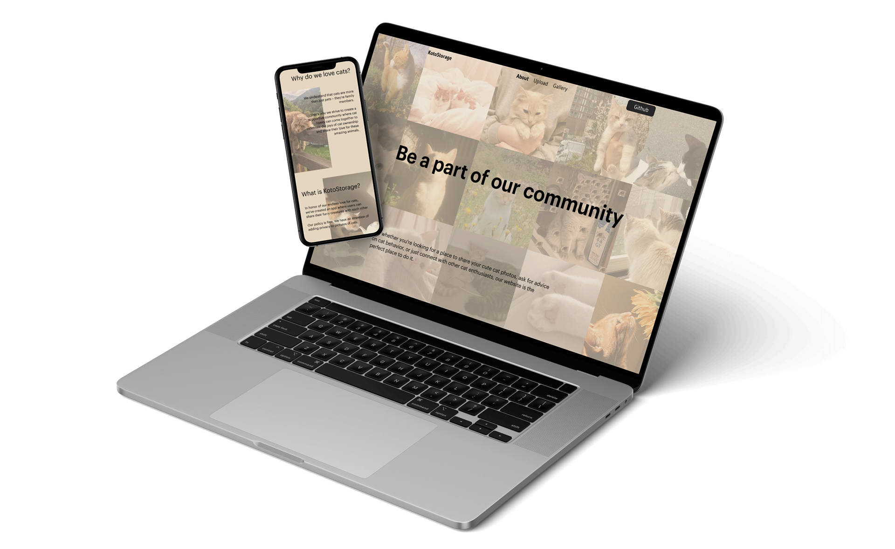

# 🐾 KotoStorage

KotoStorage is a responsive web application for cat lovers. Users can upload their favorite cat photos via URL, view a beautiful community gallery, and interact with posts by leaving likes.

## 📸 Preview

## 🔗 Live Preview

- [GitHub Pages](https://levkravtsov-dev.github.io/kotostorage/)
- [Author GitHub](https://github.com/levkravtsov-dev)

## 💡 Features

- Fully responsive layout
- Smooth burger menu for mobile devices
- Like system — click the heart icon to toggle "liked" state
- Preview uploaded images before submission
- High performance and accessibility scores
- Lazy loading for gallery images

## 💻 Tech Stack

- HTML5
- CSS3 (Flexbox, Media Queries)
- JavaScript (Vanilla ES6)

## 🗂️ Project Structure

<pre>
project/
├── css/
│   ├── reset.css
│   ├── styles.css
│   └── media.css
├── images/
├── js/
│   └── main.js
├── index.html
├── upload.html
├── gallery.html
└── README.md
</pre>

## 👨‍💻 About Me

I’m **Lev Kravtsov**, a  full-stack developer learning every day.  
Currently mastering **JavaScript** and **WordPress**, and building a portfolio to grow as a freelancer.

- 🌍 [LinkedIn](https://www.linkedin.com/in/lev-kravtsov-96a6812b4/)
- 💼 [Upwork](https://www.upwork.com/freelancers/~0166f57eef68c0685b)
- 🧑‍💻 [GitHub](https://github.com/levkravtsov-dev)

## 📫 Feedback & Collaboration

Feel free to connect with me for feedback, collaboration, or just to say hi!
